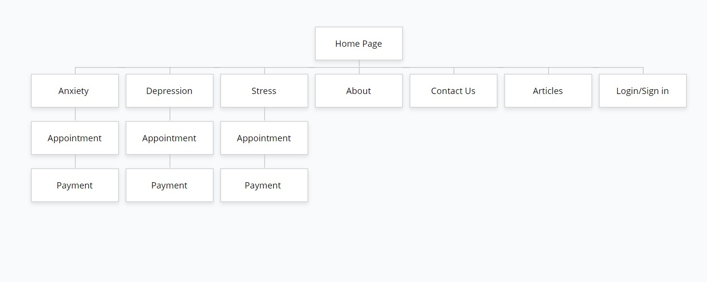

# BrighterLife
 An online counselling website for Webtech Project Section 3, Group 4

<h3>GROUP MEMBERS</h3> 
<h5>Name</h5>                                            <h5>Matric No:</h5>
<h6>Zawad Wasik Ahmed</h6>                                <h6> 1912485 </h6> 
<h6>Nurhidayu binti Ishak </h6>                           <h6> 1912604 </h6>
<h6>Nur Ameliene Lee </h6>                                <h6> 1912216 </h6>  
<h6>Turjoy Sadiul Haque </h6>                             <h6> 1910563 </h6> 

<h3> PROJECT DESCRIPTION </h3> 

BrighterLife is an online counselling platform where users can sign up and explore three categories of help that are provided by us, which are Stress, Anxiety, and Depression. Users can select which category they are currently struggling with and we will appoint a session with our professional certified therapists. Based on the availability of timings and date, the user can select a slot and book it for him/herself. We change the way people get help with facing life's challenges by providing convenient, discreet and affordable access to a licensed therapist. 
BrighterLife makes professional counseling available anytime, anywhere, through a computer, tablet or smartphone.

<h3> PROJECT SITEMAP </h3>
         

<h3> GROUP CONTRIBUTIONS </h3>

<h4> Zawad Wasik Ahmed (1912485) </h4>

1. Pages (HTML/CSS) : Homepage, Login/Signup, Anxiety, Stress, Depression 
2. Overall sitemap for the project.
3. Added Pictures on the Homepage, Stress, Anxiety and Depression. 
4. JavaScript query selector on form for Login/Signup 

<h4> Nurhidayu binti Ishak (1912604) </h4>

1. Pages (HTML/CSS) : Contact and Article
2. Web elements: Draggable message box
3. Added 5 articles using button as a link in Article page with appropriate styling
4. JavaScript popup box which is alert box for form in Contact page
5. Added all the images on Contact and Article page 

<h4> Nur Ameliene Lee (1912216) </h4>

1.
2.
3.
4. 
<h4> Turjoy Sadiul Haque (1910563) </h4>

<h3> USE OF THIRD PARTY RESOURCES </h3>

Name: Zawad Wasik Ahmed 
Web element - Login/signup 
Use of third party resources and modifications (if any)
  - jqueryselector 

Graphics for the pages are from Google Images
All graphics are inside a container div box 
All graphics are resized and positioned using CSS styling

Name: Nurhidayu binti Ishak

Web elements - Interactions draggable
Interactions draggable (JQueyUI) are used in the Contact page.
Background-color when start and stop drag
Graphics for Article and Contact
All graphics for Articles div box and background image for Contact page are from pexels.com
All graphics are resized using CSS styling

Reference : 

jqurey selectable https://jqueryui.com/selectable/

JS Foundation - js.foundation. (2021). Draggable | jQuery UI. Jqueryui.com. https://jqueryui.com/draggable/ 

100,000+ Best Dark Background Photos · 100% Free Download · Pexels Stock Photos. (2021). Pexels.com; Pexels. https://www.pexels.com/search/dark%20background/ 

